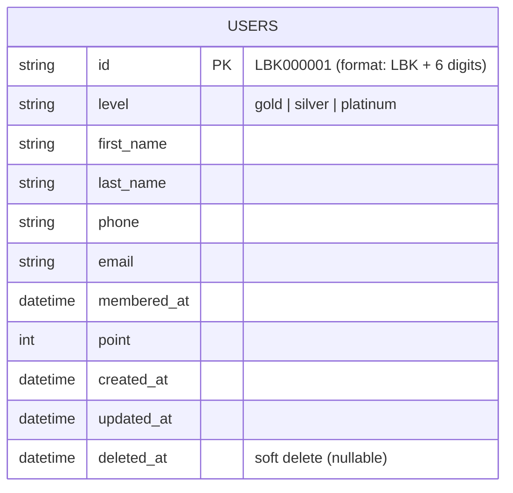

# ER Diagram (Mermaid)

เอกสารนี้แสดง ER Diagram ในรูปแบบ Mermaid สำหรับฐานข้อมูลของโปรเจค backend นี้

Notes:
- Table name: `users` (managed by GORM AutoMigrate)
- Primary key: `id` is a string with format `LBK%06d` (e.g., `LBK000001`). The app auto-generates this when creating a new user.
- `deleted_at` is used for soft deletes (GORM's `DeletedAt`).
- `membered_at` stores the membership start date/time and may be null.
- Email uniqueness/validation is not enforced by DB in the current schema (can be added with `uniqueIndex`).

If you'd like, I can:
- Export this diagram to an image (SVG/PNG)
- Add more entities and relationships (orders, events, membership tiers)
- Add constraints (unique email) and document them here
